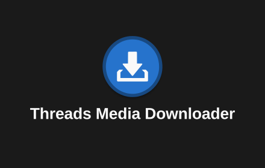
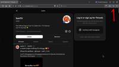
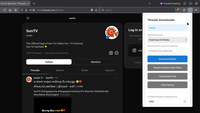
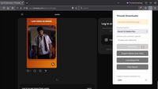
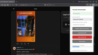
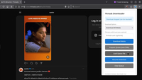

#  Threads Media Downloader

Download images and videos from Threads profile media pages — with a built-in queue and rate limiting to reduce the chance of blocked requests.

<p align="center">
  <a href="docs/media/promo_tile_440x280.png">
    
  </a>
</p>

## What it does

Threads Media Downloader helps you save media from a Threads profile's media grid (for example: `https://www.threads.net/@username/media`).

It extracts media URLs from the page, auto-scrolls to load more items, then downloads the files to your normal Downloads folder in an organized subfolder.

## Features

- Download both images and videos from a profile's `/media` page
- Choose **All media**, or limit to the **recent 50 / 100** items
- Auto-scroll to load more media (infinite scroll / pagination)
- Built-in download queue with progress UI
- Rate limiting:
  - configurable delay between downloads
  - configurable cooldown after every 100 downloads
- Queue utilities:
  - **Prepare Queue**: save extracted links to a `.txt`
  - **Load Queue File**: download later from a saved list
  - **Stop / Resume** downloads
  - **Clear Queue**
- Tries to skip files you already downloaded (based on your browser's download history and the extension's filename pattern)

## Screenshots







## Installation

- For Chrome, install from [Chrome Web Store](https://chromewebstore.google.com/detail/threads-media-downloader/jgiglfccgfjoajfgejioofaiojaljdim?authuser=0&hl=en)
- For Firefox , install from [Firefox Add-ons](https://addons.mozilla.org/en-US/firefox/addon/threads-media-downloader)

## How to use

1. Open a Threads profile media page:
   - `https://www.threads.net/@username/media` or `https://www.threads.com/@username/media`
2. Click the extension icon in your browser toolbar.
3. (Optional) Choose a download option:
   - **Download All Media**
   - **Recent 50 Media Files**
   - **Recent 100 Media Files**
4. (Optional) Set a **Filename prefix** (useful if the username can't be detected reliably).
5. Click **Download Media**.

### Where files are saved

- Media downloads: `threads-downloads/<username>/` inside your browser's default Downloads folder.
- Saved queues (link lists): `threads-queues/<username>-queue.txt` inside your browser's default Downloads folder.

### File naming

Files are named with a predictable, sortable pattern:

```text
username_001_of_150.jpg
username_002_of_150.mp4
username_003_of_150.webp
...